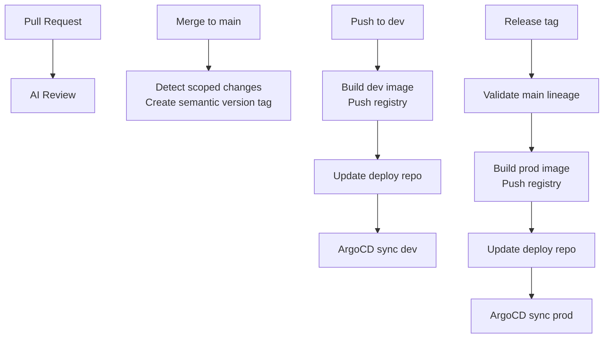

很多团队一开始做 CI/CD，目标都很朴素：代码合并后自动构建、自动发到测试环境、必要时再推到线上。

但流程一旦长起来，事情就会慢慢变味：PR 要检查，主干要打版本，测试环境要发，生产环境也要发，最后所有逻辑都堆进一堆 YAML 和脚本里。等到哪次线上出了问题，大家才发现，自己拥有的不是一条可靠的交付链路，而是一团只能靠翻日志排障的自动化拼接物。

我这次想整理的，不是“怎么把 Gitea Actions 配起来”，而是**怎么把一套通用应用交付流程拆成几个边界清楚、彼此可追踪的环节**：PR 阶段做 AI Review，主干阶段沉淀版本事实，开发环境做快速镜像验证，生产环境则通过 GitOps 交给 ArgoCD 接管发布。

<!-- truncate -->

本文基于一套真实应用 workflow 设计整理而成。原始场景里用的是多目录应用仓库，但这里我会尽量从**通用应用工作流**的角度来讲，而不是把重点放在仓库组织形式上。

为便于公开分享，文中的域名、镜像仓库、部署仓库、Token、Secret 名称、云账号信息都已脱敏；示例里的 `<...>` 占位符，表示在实际环境中需要替换成内部配置。

## 先把问题拆开：为什么 CI/CD 容易越做越乱

无论你的应用是单仓库单服务、前后端分离，还是多应用仓库，CI/CD 一旦走到线上交付阶段，通常都会遇到几个共性问题：

- 测试环境和生产环境的发布语义完全不同，却常常被同一套脚本粗暴处理。
- CI 既负责构建，又直接连 Kubernetes 集群做部署，权限边界不清晰。
- 回滚、审计、追溯都只能靠零散日志，而不是系统性记录。
- 当一个仓库承载多个可发布单元时，版本、构建和发布节奏很容易彼此牵连。

所以这套设计的目标，不是“自动化越多越好”，而是把链路拆成几个清晰阶段：

1. **PR 阶段**自动做 AI Review，提前发现代码质量和安全问题。
2. **合并到 `main` 后**，基于真实变更生成对应版本标签。
3. **`dev` 分支变更后**，自动构建测试环境镜像，并更新 GitOps 部署仓库。
4. **生产发布时**，只允许从合法 release tag 构建生产镜像，并由 ArgoCD 根据部署仓库变更完成落地。

用一句话概括就是：

```text
PR 阶段做质量反馈，main 阶段做版本事实，dev 阶段做快速验证，prod 阶段做可审计发布。
```

## 先看整体：这套交付链路是怎么分层的

整条链路我更愿意把它理解成四层。先看一张更适合博客阅读的 Mermaid 图：



如果按职责边界来拆，它对应的是这样四层：

```text
Code Review Layer -> PR 反馈
Versioning Layer  -> 版本事实
Build Layer       -> 镜像产物
GitOps Layer      -> 部署声明 + ArgoCD 落地
```

这里最关键的一点是：**CI 不直接操作 Kubernetes 集群，而是更新部署仓库中的 `kustomization.yaml`。**

也就是说，应用仓库只负责两件事：

- 产出镜像
- 声明“我要部署哪个镜像 tag”

真正把这个声明同步到集群里的，是 **ArgoCD**。它持续 watch GitOps 部署仓库，一旦看到期望状态发生变化，就把对应环境推进到新的镜像版本。

这类拆法的好处非常直接：

- 构建记录、镜像 tag、部署仓库 commit 可以互相追踪。
- CI 不需要长期持有集群高权限凭据。
- 回滚时不必重新构建，只需要把部署仓库里的镜像 tag 改回去。
- 环境差异集中在部署仓库和 Secret，而不是散落在 shell 脚本里。

## 第一层：把 AI Review 放在 PR 入口，而不是合并之后

对应文件：`.gitea/workflows/ai-review.yml`

这一层的职责很简单：**在代码进入 `main` 之前，增加一层自动化质量反馈。**

### 触发时机

```yaml
on:
  pull_request:
    branches: [main]
    types: [opened, synchronize, reopened]
```

也就是说，下面三种情况会触发：

- 新开 PR
- PR 补充了新 commit
- 已关闭的 PR 被重新打开

### 核心思路

PR Review 不是在 runner 上临时拼依赖，而是直接跑一个固定版本的 PR-Agent Docker 镜像：

```yaml
- name: Run PR-Agent
  env:
    GITEA_TOKEN: ${{ secrets.PR_REVIEW_BOT_TOKEN }}
    LLM_API_KEY: ${{ secrets.LLM_API_KEY }}
    GITEA_URL: <GITEA_BASE_URL>
    PR_URL: ${{ gitea.event.pull_request.html_url }}
    RESPONSE_LANGUAGE: zh-CN
    PR_REVIEWER_REQUIRE_SECURITY_REVIEW: "true"
    PR_REVIEWER_NUM_MAX_FINDINGS: "10"
  run: |
    set -euo pipefail

    IMAGE="<PR_AGENT_IMAGE>:<PINNED_VERSION>"
    docker pull "$IMAGE"

    docker run --rm \
      -e CONFIG__GIT_PROVIDER="gitea" \
      -e GITEA__URL="$GITEA_URL" \
      -e GITEA__PERSONAL_ACCESS_TOKEN="***" \
      -e CONFIG__MODEL="<LLM_MODEL>" \
      -e CONFIG__RESPONSE_LANGUAGE="$RESPONSE_LANGUAGE" \
      -e PR_REVIEWER__REQUIRE_SECURITY_REVIEW="$PR_REVIEWER_REQUIRE_SECURITY_REVIEW" \
      -e PR_REVIEWER__NUM_MAX_FINDINGS="$PR_REVIEWER_NUM_MAX_FINDINGS" \
      -e <LLM_PROVIDER_KEY_ENV>="$LLM_API_KEY" \
      "$IMAGE" \
      --pr_url="$PR_URL" \
      review
```

### 为什么这一层值得单独存在

我比较认同把 AI Review 放在 PR 阶段，而不是合并之后。这样它的定位是**提前反馈**，不是事后审计。

这层设计有几个很实用的细节：

1. **镜像版本固定，而不是用 `latest`**
   - 自动化流程最怕上游行为漂移。今天能跑，明天镜像更新后 review 风格变了，排查会很痛苦。

2. **通过 Docker 运行，而不是在 runner 上现场装依赖**
   - 环境更稳定，也更容易迁移和复现。

3. **限制 findings 数量**
   - AI reviewer 太“热情”时很容易制造噪音。把问题数限制在一个合理范围，本质上是在逼它挑最重要的点讲。

4. **强制安全审查维度**
   - 这让它不只是“代码风格意见机”，而是能在边界条件、潜在风险上补一刀。

这层的边界也很明确：它**不负责构建、不负责版本、不负责部署**，只负责在进入主干前尽量把明显问题拦下来。

## 第二层：先识别变更，再生成版本标签

对应文件：`.gitea/workflows/auto-version-tags.yml`

对很多应用团队来说，版本管理往往比 CI 本身更容易失控。表面上看，打 tag 只是一步 Git 操作；但真正难的是：**什么变更值得发版、哪个可发布单元应该发版、版本号应该怎么演进。**

这套设计的做法是：**先识别真实变更范围，再给对应可发布单元生成独立 tag。** 在多应用仓库里，这通常体现为“每个 app 一条版本线”；在单应用仓库里，也可以退化成“主应用一条版本线”。

### 触发时机

```yaml
on:
  push:
    branches: [main]
    paths:
      - src/app-a/**
      - src/app-b/**
      - src/shared-lib/**
      - .gitea/workflows/auto-version-tags.yml
  workflow_dispatch:
```

这里保留 `workflow_dispatch`，是为了在特殊情况下手工重跑，比如补 tag、修 tag、重新计算版本。

### Matrix：每个可发布单元各算各的版本线

```yaml
strategy:
  fail-fast: false
  matrix:
    include:
      - app: app-a
        app_path: src/app-a
        tag_prefix: app-a/v
      - app: app-b
        app_path: src/app-b
        tag_prefix: app-b/v
      - app: shared-lib
        app_path: src/shared-lib
        tag_prefix: shared-lib/v
```

这会生成类似这样的 tag：

```text
app-a/v1.2.3
app-b/v1.4.0
shared-lib/v0.8.9
```

这里故意用更抽象的 `app-a / app-b / shared-lib` 举例，是为了突出设计本身，而不是某个具体业务目录。核心意思只有一个：**仓库可以统一协作，但可发布单元不一定要共享同一条版本线。**

如果你只有一个主应用，这套思路同样适用，只是 matrix 可以简化成一个单元，tag 也可以变成更普通的 `v1.2.3`。

### 核心逻辑：不是看仓库变没变，而是看这个 app 变没变

真正的关键点在这里：

```bash
git fetch --tags --force

last_tag="$(git tag --list "${TAG_PREFIX}*" --sort=-v:refname | head -n1 || true)"

if [ -n "${last_tag:-}" ]; then
  commit_count="$(git rev-list --count "${last_tag}..HEAD" -- "${APP_PATH}")"
else
  commit_count="$(git rev-list --count HEAD -- "${APP_PATH}")"
fi

if [ "${commit_count}" -eq 0 ]; then
  echo "should_tag=false" >> "$GITHUB_OUTPUT"
  exit 0
fi
```

这里的重点不是“自上次 tag 以来仓库有没有变化”，而是：

> **这个可发布单元自上次属于它的 tag 以来，有没有变化。**

在示例里，这个“单元”是某个应用目录；换成单服务仓库时，也可以直接是整个项目本身。真正值得保留的，不是 Monorepo 形式，而是**按真实交付边界计算版本**这件事。

### SemVer 如何自动推断

版本升级类型沿用 Conventional Commits：

```bash
bump_type="patch"

if printf '%s\n' "${subjects}" | grep -Eq '^[^[:space:]]+!:'; then
  bump_type="major"
elif printf '%s\n' "${bodies}" | grep -Eq '(^|[[:space:]])BREAKING CHANGE:'; then
  bump_type="major"
elif printf '%s\n' "${subjects}" | grep -Eq '^feat(\([^)]*\))?:'; then
  bump_type="minor"
fi
```

对应规则就是：

```text
breaking change -> major
feat             -> minor
other changes    -> patch
```

好处是它不需要额外维护版本文件，而是直接把 Git 历史和 commit 规范变成版本事实来源。

### 为什么用 annotated tag

如果决定发版，workflow 会创建 annotated tag，而不是 lightweight tag：

```bash
git tag -a "${NEW_TAG}" \
  -m "release(${APP_NAME}): ${NEW_TAG}" \
  -m "${tag_body}"

git push origin "${NEW_TAG}"
```

tag body 里还会记录：

- bump type
- changed commits count
- commit sha
- commit author
- commit time

这让 tag 不只是“一个名字”，而更像一条可审计的发布记录。

### 并发控制

```yaml
concurrency:
  group: auto-version-${{ matrix.app }}-${{ gitea.ref_name }}
  cancel-in-progress: false
```

这里按 `app + branch` 建并发组，并且不取消正在执行的版本计算。这样做虽然保守，但能避免多个 push 之间互相打断，导致 tag 状态前后不一致。

## 第三层：Dev 环境要快，但也要可追踪

对应文件：`.gitea/workflows/build-and-deploy-dev.yml`

到了这一层，目标就从“质量反馈 / 版本事实”切换成了：

> **让测试环境始终对应某个具体 commit 的可追踪镜像。**

### 触发时机

```yaml
on:
  push:
    branches: [dev]
    paths:
      - src/app-a/**
  workflow_dispatch:
```

这里用 `src/app-a/**` 作为示例，表示“当前要发布的目标应用路径”。如果你的仓库只有一个主应用，这里的路径过滤甚至可以简化到整个项目。重点不是目录名字，而是：**只在真正影响目标交付单元时触发构建。**

### 显式分支校验：给 workflow 再加一道保险

即便触发条件已经写死 `dev`，脚本里仍然会再做一次校验：

```bash
if [ "${CURRENT_BRANCH:-}" != "${EXPECTED_BRANCH}" ]; then
  echo "this workflow only runs on branch: ${EXPECTED_BRANCH}"
  exit 1
fi
```

这是一个很值得保留的小习惯。CI 的触发上下文、手动触发、未来配置漂移，都可能带来意外执行路径。脚本内部再校验一次，能让失败更明确，而不是默默跑偏。

### Dev 环境为什么用短 SHA 做镜像 tag

metadata 解析后，Dev 镜像用短 commit SHA 作为 tag：

```bash
commit_sha="${GITEA_SHA:-}"
if [ -z "$commit_sha" ]; then
  commit_sha="$(git rev-parse HEAD)"
fi

image_tag="$(printf '%s' "$commit_sha" | cut -c1-7)"
```

产物大概是这样：

```text
<IMAGE_REPO>:<SHORT_SHA>
```

这对测试环境非常合适，因为它强调的是：

- 当前环境到底跑的是哪次提交
- 问题出现时能快速定位回源码 commit
- 每个镜像版本都天然不可变

换句话说，**dev 的重点是追踪提交，不是强调语义化版本。**

### 构建阶段如何处理环境变量

workflow 会把 Secret 写入目标应用构建所需的 `.env.production`，并在退出时清理：

```bash
build_env_path="src/app-a/.env.production"
trap 'rm -f "$build_env_path"' EXIT
printf '%s\n' "$BUILD_ENV_FILE" > "$build_env_path"
```

之后逐行校验 `.env` 格式，只检查 `key=value` 是否成立，不打印 Secret 内容：

```bash
while IFS= read -r raw_line || [ -n "$raw_line" ]; do
  line="$(printf '%s' "$raw_line" | sed -e 's/^[[:space:]]*//' -e 's/[[:space:]]*$//')"
  [ -z "$line" ] && continue

  case "$line" in
    \#*) continue ;;
  esac

  key="${line%%=*}"
  key="$(printf '%s' "$key" | tr -d '[:space:]')"

  if [ -z "$key" ] || [ "$key" = "$line" ]; then
    echo "invalid env entry"
    exit 1
  fi
done < "$build_env_path"
```

这不是绝对安全方案，但至少做到了两件重要的事：

- Secret 不会在日志里裸奔
- 临时文件不会长期残留在 runner 上

### 镜像构建完成后，不直接部署，而是改 GitOps 仓库

镜像 push 完毕之后，workflow 会 clone 部署仓库，更新 `kustomization.yaml` 里的镜像 tag：

```bash
git clone --depth 1 \
  --branch "$DEPLOY_BRANCH" \
  "https://oauth2:***@<GITEA_HOST>/${DEPLOY_REPO}.git" \
  "$repo_dir"

cd "$repo_dir"

(
  cd "${DEPLOY_DIR}"
  kustomize edit set image "${IMAGE_REPO}:${IMAGE_TAG}"
)
```

如果 `kustomization.yaml` 没变化，就跳过 commit：

```bash
if git diff --quiet -- "${DEPLOY_DIR}/kustomization.yaml"; then
  echo "deploy values tag already ${IMAGE_TAG}, skip commit"
  exit 0
fi
```

否则就提交部署声明：

```bash
git add "${DEPLOY_DIR}/kustomization.yaml"
git commit -m "ci(dev): bump <image-name> test image tag to ${IMAGE_TAG}"
git push origin "$DEPLOY_BRANCH"
```

到这里，应用仓库的工作其实已经结束了。真正把这个新 tag 同步到测试集群的，是 ArgoCD：

1. ArgoCD watch 到部署仓库变化
2. 发现目标环境的 `kustomization.yaml` 镜像 tag 更新
3. 将期望状态同步到集群

这就是 GitOps 的核心价值：**CI 只改 Git 中的期望状态，不直接改集群当前状态。**

## 第四层：Prod 发布最重要的不是构建，而是证明来源合法

对应文件：`.gitea/workflows/build-and-deploy-prod.yaml`

生产发布最大的区别，不是“也构建镜像”，而是**必须证明这次发布来自合法来源**。

### 触发时机

```yaml
on:
  release:
    types: [published]
  workflow_dispatch:
```

但是 release 事件并不是任何 tag 都放行，而是只接受某一类约定好的应用 release tag，例如：

```yaml
if: ${{ gitea.event_name != 'release' || startsWith(gitea.ref, 'refs/tags/app-a/v') }}
```

### 生产发布最关键的一步：校验 release 来源

这一层做了两道检查。

第一道，tag 名本身必须合法：

```bash
if [[ "${CURRENT_BRANCH:-}" != app-a/v* ]]; then
  echo "this workflow only handles app-a release tags"
  exit 1
fi
```

第二道，release commit 必须属于 `main` 分支历史：

```bash
release_commit="$(git rev-parse "${CURRENT_REF}^{commit}" 2>/dev/null || true)"

git fetch --no-tags --prune origin "${EXPECTED_BRANCH}"
main_ref="FETCH_HEAD"

if ! git merge-base --is-ancestor "${release_commit}" "${main_ref}"; then
  echo "release commit is not on branch: ${EXPECTED_BRANCH}"
  exit 1
fi
```

这一步特别重要。它防止了几类常见事故：

- 从临时分支直接打 tag 发生产
- 从未合并到主干的 commit 发布生产
- 因为手工操作失误，把错误 tag 推成 release

### 为什么生产镜像不用短 SHA，而用 release 版本

Dev 镜像用短 SHA，Prod 则从 release tag 派生版本号：

```bash
release_tag="${RELEASE_TAG}"
image_tag="${release_tag#app-a/}"
```

例如：

```text
app-a/v1.2.3 -> <IMAGE_REPO>:v1.2.3
```

这样做的好处非常直接：

- 变更审计更自然
- 回滚版本更直观
- 业务发布记录和镜像版本可以对齐
- 部署仓库里一眼就能看出当前线上版本

也就是说：

```text
dev  -> commit-oriented
prod -> release-oriented
```

这是这套流程里我自己最喜欢的一个分层。

### 生产环境的 GitOps 终点，依然是 ArgoCD

生产 workflow 后半段和 dev 基本一致：写入构建环境、校验格式、登录 registry、构建并 push 镜像、更新部署仓库。

差别只是：

- 使用生产环境变量
- 更新生产环境对应的 kustomize 目录
- 镜像 tag 换成 release 版本

最终，生产环境也不是由 CI 直接下场改集群，而是由 **ArgoCD** 读取部署仓库中的变更并执行同步。

从边界角度看，这意味着：

- **Gitea Actions** 负责构建产物和更新期望状态
- **GitOps 仓库** 负责保存环境声明
- **ArgoCD** 负责把声明落到 Kubernetes 集群

三者分工清晰，出了问题也更容易定位到底卡在哪一层。

## Dev 和 Prod，本质上是两种不同的发布语义

很多团队会把 dev / prod 仅仅理解成“两个环境变量文件”。但实际上，这两条链路背后的设计目标完全不同：

| 维度 | Dev | Prod |
|---|---|---|
| 触发来源 | `dev` 分支 push | `release published` 或手动触发 |
| 路径过滤 | `src/app-a/**` | 由 release tag 限定目标应用 |
| 合法性校验 | 当前分支必须是 `dev` | release tag 必须是 `app-a/v*`，commit 必须在 `main` 历史内 |
| 镜像 tag | 短 commit SHA | release 版本，如 `v1.2.3` |
| 环境变量 | `<DEV_APP_ENV_FILE>` | `<PROD_APP_ENV_FILE>` |
| 部署目录 | `<DEV_KUSTOMIZE_DIR>` | `<PROD_KUSTOMIZE_DIR>` |
| 发布语义 | 快速验证 | 正式发布、可审计、可回滚 |

测试环境追求的是“快”和“可追踪到提交”；生产环境追求的是“稳”和“可证明来源”。把这两种语义硬塞进同一条流程里，往往就是后面复杂度失控的起点。

## 这套设计最值得保留的 5 个点

### 1. 按可发布单元独立版本化

通过 `app_path + tag_prefix` 的 matrix，这套流程可以让每个可发布单元拥有自己的版本线。放在多应用仓库里，它意味着不同应用互不绑死；放在单应用仓库里，它也可以简化成一条清晰的主版本线。

### 2. Dev 和 Prod 使用不同 tag 语义

dev 关心“我在跑哪次提交”，prod 关心“我在跑哪个发布版本”。短 SHA 和 release tag 分开，语义特别干净。

### 3. GitOps + ArgoCD，而不是 CI 直接连集群

这是权限和可追踪性上的巨大提升。CI 改 Git，ArgoCD 改集群，职责边界天然更稳。

### 4. 生产发布做来源校验

不只是检查 tag 名，还检查 release commit 是否属于 `main` 历史，这一步非常像“生产闸门”。

### 5. Secret 泄漏控制做到了最低限度的工程自觉

构建 env 来自 Secret，写入临时文件，校验时不打印 value，退出时清理文件。虽然不算终点方案，但至少已经避免了最常见的日志泄漏问题。

## 如果继续往前走，这 5 个地方最值得改

这套设计已经能跑得很稳了，但如果继续打磨，我觉得还有几件事特别值得做。

### 1. 把 dev / prod 共用逻辑抽成脚本

比如拆成：

```text
scripts/ci/resolve-image-metadata.sh
scripts/ci/write-build-env.sh
scripts/ci/build-and-push-image.sh
scripts/ci/update-kustomize-image.sh
```

这样 workflow 只负责声明“何时触发”和“注入哪些变量”，复杂逻辑则放进可本地测试的脚本里。

### 2. 给构建和部署 workflow 也补上 concurrency

版本 workflow 已经有并发控制，但 dev/prod 部署更新如果同时改同一个 `kustomization.yaml`，依然可能 push 冲突。可以考虑：

```yaml
concurrency:
  group: deploy-app-a-dev
  cancel-in-progress: false
```

### 3. 在生产发布里记录镜像 digest

现在部署仓库里记录的是 tag。进一步增强供应链可追踪性的话，可以在 release note 或部署记录里同时写入 digest：

```text
<IMAGE_REPO>:v1.2.3@sha256:<digest>
```

tag 适合人读，digest 适合机器确认不可变产物。

### 4. 把 env 校验从格式升级成必需 key 校验

当前只校验 `key=value` 格式是对的，但还可以进一步维护必需 key 列表，在构建前更早发现配置缺失。

### 5. 给手动触发生产 workflow 增加显式输入

例如要求手工输入 `app-a/v1.2.3` 这类 release tag，而不是完全依赖当前上下文。这样误操作空间会更小。

## 总结：好的 CI/CD，不是更长的流水线，而是更清楚的边界

如果只用一句话概括这套设计，我会这样说：

> **它不是把所有事情塞进一条巨型 pipeline，而是把代码质量、版本事实、构建产物和部署声明拆成了相互独立但又彼此可追踪的环节。**

四个 workflow 分别负责不同层次的职责：

- `ai-review` 负责 PR 反馈
- `auto-version-tags` 负责应用级版本
- `build-dev-image` 负责测试环境镜像与部署声明更新
- `build-and-deploy-prod-image` 负责生产 release 镜像与部署声明更新

而在部署侧，**ArgoCD** 把 GitOps 仓库里的期望状态真正同步到 Kubernetes 集群中，补上了“从声明到落地”的最后一环。

这套拆法对通用应用交付都成立：如果你是单应用，它能帮你把质量、版本、构建、部署边界拆干净；如果你是多应用仓库，它又能进一步承接独立版本和独立发布节奏。更重要的是，构建产物、版本标签、部署记录都留在了可追踪系统里：镜像仓库记录产物，Git tag 记录版本，部署仓库记录环境状态，ArgoCD 记录同步结果。

一旦线上出问题，你就能从环境里的镜像 tag，一路追到部署仓库 commit、release tag、主干 commit、PR 和 Review 记录。

这大概就是我理解里一套 CI/CD 设计最有安全感的地方：**不是保证永远不出错，而是让每一次变化都有来源、有记录、能回滚。**
