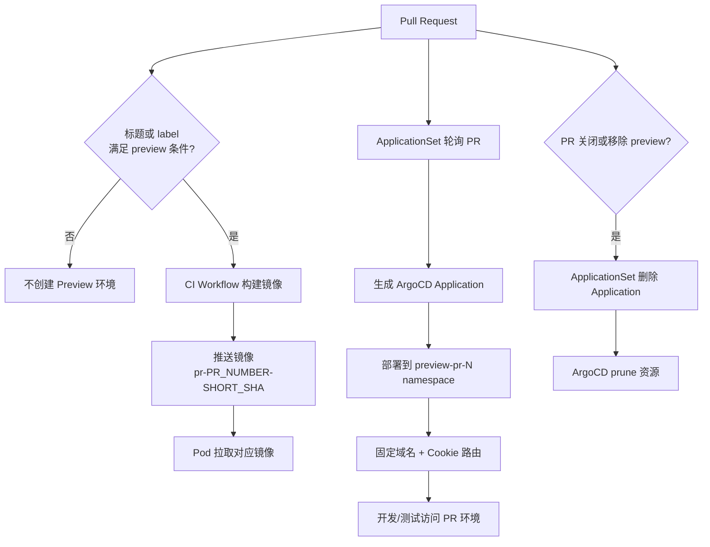

很多团队最早的测试环境都很简单：大家共用一套 `dev`，分支一提交，CI 构建镜像，然后更新部署仓库里的镜像 tag，最后由 ArgoCD 同步到 Kubernetes。

这套方式在团队规模小、需求串行推进时非常够用。但只要多个功能分支开始并行测试，问题就会迅速暴露：A 分支刚部署完，B 分支又覆盖了环境；测试同学发现一个问题，却很难判断当前环境到底对应哪个 PR、哪个 commit；开发排查时还要先问一句“现在 dev 上是谁的版本”。

<!-- truncate -->

更好的办法是把“公共测试环境”之外的并行验证能力单独拆出来：**只有明确需要验证的 PR，才创建一套临时 Preview 环境；PR 更新时环境自动更新；PR 关闭后环境自动回收。**

这篇文章整理一种相对轻量的实现方式：用 CI Workflow 负责构建不可变镜像，用 ArgoCD ApplicationSet 根据 PR 状态声明式创建应用，用 Kubernetes namespace 做环境隔离，再通过固定域名加 cookie 路由访问不同 PR 环境。

为便于公开分享，文中的业务名称、域名、仓库名、镜像仓库和集群地址都使用通用占位符。

## 先说目标：Preview 环境不是“再造一套 dev”

Preview 环境的目标不是把测试环境数量简单乘以 N，而是解决多分支并行验证时的几个核心问题：

1. **不是所有 PR 都创建环境**：否则资源会被大量临时分支拖垮。
2. **每个环境能对应到明确 PR 和 commit**：方便定位问题、追溯版本。
3. **CI 只负责构建镜像**：不要让 CI 直接持有 Kubernetes 高权限。
4. **ArgoCD 负责声明式部署和回收**：让环境生命周期跟 PR 状态绑定。
5. **Preview 环境可追踪、可回收、可扩展**：后续可以扩展后端、MQ、资源配额和访问控制。

换句话说，它不是“谁提交代码谁覆盖 dev”，而是：

```text
一个需要测试的 PR -> 一套独立的临时运行环境 -> 一个可追踪的镜像版本
```

## 总体架构：CI 产物与 GitOps 部署解耦

整体链路可以概括为：

```text
开发创建 PR
  -> PR 满足 preview 触发条件
  -> CI Workflow 构建镜像
  -> 镜像 tag 使用 pr-<PR_NUMBER>-<SHORT_SHA>
  -> ArgoCD ApplicationSet 发现该 PR
  -> 自动生成一个 ArgoCD Application
  -> Application 部署到独立 namespace
  -> 用户通过固定域名 + cookie 路由访问对应 PR 环境
```

如果画成流程图，大概是这样：



这里最重要的是职责拆分：

- **源码仓库**：负责 CI workflow、镜像构建、测试通知。
- **部署仓库**：负责 Kubernetes manifests、Kustomize overlay、ArgoCD ApplicationSet。
- **ArgoCD**：负责根据 PR 状态创建、更新、删除 Application。
- **Kubernetes**：负责承载每个 PR 的独立 namespace 和运行资源。

这个拆法的好处是：CI 不需要知道集群细节，ArgoCD 也不需要构建镜像。两边通过一个稳定的事实对齐：**镜像 tag**。

## Preview 触发条件：显式 opt-in，而不是所有 PR 自动部署

Preview 环境通常会占用真实集群资源，所以不建议所有 PR 都自动创建。更稳妥的方式是让开发显式 opt-in。

最简单的做法是要求 PR 标题包含：

```text
[preview]
```

例如：

```text
[preview] 调整订单列表筛选逻辑
```

CI Workflow 中可以用条件判断：

```yaml
on:
  pull_request:
    branches: [main]
    types: [opened, synchronize, reopened, edited]

jobs:
  build_preview_image:
    if: contains(gitea.event.pull_request.title, '[preview]')
    runs-on: ubuntu-latest
    steps:
      - name: Checkout
        uses: actions/checkout@v4

      - name: Build and push preview image
        run: |
          echo "build preview image here"
```

ApplicationSet 里也使用相同过滤条件：

```yaml
filters:
  - titleMatch: '.*\[preview\].*'
```

这样只有满足条件的 PR 才会触发三件事：

1. 构建 preview 镜像。
2. 创建 ArgoCD Application。
3. 部署独立 preview namespace。

后续如果需要更强控制，可以把触发条件从 PR 标题升级为 PR label，例如：

```text
preview/enabled
```

标题方式实现简单，label 方式更适合生产流程，因为 label 可以由维护者、机器人或审批流程控制。

## 镜像 Tag：让 PR 和 commit 成为可追踪事实

Preview 镜像 tag 建议同时包含 PR 编号和 commit 短 SHA：

```text
pr-<PR_NUMBER>-<SHORT_SHA>
```

例如：

```text
pr-123-a1b2c3d
```

它有几个直接好处：

- 一眼能看出镜像来自哪个 PR。
- 一眼能看出镜像来自哪个 commit。
- PR 更新后，镜像 tag 自动变化。
- ArgoCD 可以根据 PR 当前 head sha 推导目标镜像。

CI 构建完成后推送镜像：

```text
registry.example.com/project/frontend:pr-123-a1b2c3d
```

对应到 workflow，大致可以这样组织：

```yaml
jobs:
  build_preview_image:
    if: contains(gitea.event.pull_request.title, '[preview]')
    runs-on: ubuntu-latest
    steps:
      - name: Checkout
        uses: actions/checkout@v4

      - name: Compute image tag
        id: vars
        run: |
          SHORT_SHA=$(echo "${{ gitea.event.pull_request.head.sha }}" | cut -c1-7)
          echo "tag=pr-${{ gitea.event.pull_request.number }}-${SHORT_SHA}" >> "$GITHUB_OUTPUT"

      - name: Build image
        run: |
          docker build \
            -t registry.example.com/project/frontend:${{ steps.vars.outputs.tag }} \
            .

      - name: Push image
        run: |
          docker push registry.example.com/project/frontend:${{ steps.vars.outputs.tag }}
```

这里的关键点是：**preview 镜像应该是不可变产物**。不要给多个 commit 复用同一个 `preview-latest`，否则测试环境的可追踪性会被破坏。

## ApplicationSet：根据 PR 自动生成 Application

ApplicationSet 使用 Pull Request Generator 监听代码平台里的 PR。下面是一个基于 Gitea 的示例结构：

```yaml
apiVersion: argoproj.io/v1alpha1
kind: ApplicationSet
metadata:
  name: project-preview-pr
  namespace: argocd
spec:
  goTemplate: true

  generators:
    - pullRequest:
        gitea:
          owner: <org>
          repo: <source-repo>
          api: https://git.example.com/
          tokenRef:
            secretName: gitea-token
            key: token
        filters:
          - titleMatch: '.*\[preview\].*'
        requeueAfterSeconds: 180

  template:
    metadata:
      name: 'preview-pr-{{ .number }}'
    spec:
      project: project-preview
      source:
        repoURL: https://git.example.com/<org>/<deploy-repo>.git
        targetRevision: main
        path: previews/project
        kustomize:
          namespace: 'preview-pr-{{ .number }}'
          images:
            - 'registry.example.com/project/frontend:pr-{{ .number }}-{{ .head_short_sha_7 }}'
      destination:
        server: https://kubernetes.default.svc
        namespace: 'preview-pr-{{ .number }}'
      syncPolicy:
        automated:
          prune: true
          selfHeal: true
        syncOptions:
          - CreateNamespace=true
```

ApplicationSet 的行为可以理解为：

```text
PR 满足条件
  -> 创建 preview-pr-<PR_NUMBER> Application

PR 更新
  -> 重新渲染 Application 参数，例如镜像 tag

PR 关闭或移除 [preview]
  -> 删除对应 Application

Application 删除
  -> ArgoCD prune 该 Application 管理的资源
```

这里有一个很有价值的边界：**CI 不需要去改 ApplicationSet，也不需要直接 kubectl apply**。它只要把符合命名规则的镜像推到仓库即可。ApplicationSet 会根据 PR 当前 head sha 自己推导出应该部署哪个镜像。

## CI 与 ArgoCD 是最终一致，而不是强事务

这套设计里，CI 和 ArgoCD 是两条解耦链路：

```text
CI Workflow
  -> 构建并推送镜像

ArgoCD ApplicationSet
  -> 根据 PR 状态生成期望部署状态
```

这意味着它们不是强事务关系，可能出现一种短暂状态：

```text
ArgoCD 已经开始同步
但镜像还没推送完成
```

此时 Pod 可能会短暂出现：

```text
ImagePullBackOff
ErrImagePull
```

通常这不是设计错误。镜像推送完成后，Kubernetes 会自动重试拉取并恢复。

如果业务要求严格保证“镜像构建完成后才部署”，可以升级成更复杂的 ready 标记机制，例如：

- CI 构建成功后写入 deploy repo。
- CI 构建成功后给 PR 打 `build-ready` label。
- CI 写入一个 preview metadata 文件，ApplicationSet 或其他控制器再读取。

但这会增加控制面复杂度。多数 Preview 场景可以接受最终一致，因为 Preview 环境本身服务的是短周期验证，不是生产发布。

## 访问路由：固定域名加 cookie 区分 PR

如果每个 PR 都申请一个独立域名，DNS、证书、Ingress 规则都会变复杂。更轻量的方式是使用固定域名：

```text
https://preview.example.com
```

然后通过 cookie 区分当前要访问哪个 PR：

```text
preview_route=pr-123.
```

Ingress 里可以配置基于 cookie 的转发条件，例如：

```yaml
alb.ingress.kubernetes.io/conditions.frontend: >
  [{"field":"http-header","httpHeaderConfig":{"httpHeaderName":"Cookie","values":["*preview_route=pr-123.*"]}}]
```

这里建议 cookie value 带一个结束符，比如：

```text
pr-123.
```

而不是简单写成：

```text
pr-123
```

原因是要避免 `pr-12` 误匹配到 `pr-123`。

这种设计的核心思路是：

```text
同一个 preview 域名
  -> 根据 cookie 选择不同 PR namespace 下的服务
```

## Selector 页面：不要让开发手动改 cookie

为了避免开发和测试手动设置 cookie，可以提供一个 selector 页面：

```text
https://preview.example.com/select
```

用户输入 PR 编号后，selector 写入 cookie：

```text
preview_route=pr-123.
```

然后跳转到：

```text
https://preview.example.com/app
```

也可以支持直接链接：

```text
https://preview.example.com/select?pr=123
```

这样 CI 通知里就可以直接发送 selector 链接：

```text
Preview 环境已创建：
https://preview.example.com/select?pr=123
```

selector 页面不需要复杂，它本质上只是一个“路由选择器”。但它能显著降低使用成本：开发、测试、产品只需要点链接，不需要理解 cookie 和 Ingress 细节。

需要注意：**cookie 路由不是鉴权**。它只是把请求路由到不同 Preview 环境，不应该被当作安全边界。真正的访问控制应该放在统一认证层、网关、WAF 或内网访问控制中。

## AppProject：给 Preview 环境单独收权限

Preview 环境会自动创建很多 Application，如果不加限制，很容易变成一个权限过大的自动化入口。建议为 Preview 单独创建 ArgoCD AppProject：

```yaml
apiVersion: argoproj.io/v1alpha1
kind: AppProject
metadata:
  name: project-preview
  namespace: argocd
spec:
  sourceRepos:
    - https://git.example.com/<org>/<deploy-repo>.git

  destinations:
    - server: https://kubernetes.default.svc
      namespace: preview-pr-*

  clusterResourceWhitelist:
    - group: ""
      kind: Namespace

  namespaceResourceWhitelist:
    - group: "*"
      kind: "*"
```

AppProject 的作用是限制：

1. 哪些 Git 仓库可以作为部署来源。
2. 可以部署到哪些 namespace。
3. 可以创建哪些 Kubernetes 资源。

这里要特别注意：`sourceRepos` 只是权限白名单，不是 Git 凭据。ArgoCD 仍然需要单独配置 repository credential，否则 repo-server 拉部署仓库时仍然会报：

```text
Git authentication required
```

这类问题不要误判成 Pull Request Generator 的 token 失效。PR token 负责读 PR，repo credential 负责拉部署仓库，它们是两套凭据。

## PR 关闭后的资源回收：重点盯住 namespace

PR 关闭后，ApplicationSet 下一轮轮询时会发现该 PR 不再存在，或者不再满足过滤条件，于是删除对应 Application。

但这里有个容易踩的坑：如果 namespace 是通过下面这个 sync option 自动创建的：

```yaml
syncOptions:
  - CreateNamespace=true
```

那么 namespace 本身不一定会随着 Application 删除而删除。

也就是说，Application 管理的 Deployment、Service、Ingress 等资源可能被 prune 掉了，但 namespace 还留着。

解决方式通常有两种。

第一种：把 Namespace 显式放进 manifests，让它成为 ArgoCD 管理资源：

```yaml
apiVersion: v1
kind: Namespace
metadata:
  name: preview-pr-123
```

第二种：定期运行 cleanup job，删除已经没有对应 Application 的 preview namespace：

```text
列出 preview-pr-* namespace
  -> 查询是否存在同名 ArgoCD Application
  -> 不存在则删除 namespace
```

生产级 Preview 环境建议至少实现一种 namespace 清理机制，否则 PR 关闭后可能留下大量空 namespace、Secret、ConfigMap 或 ResourceQuota。

## Secret 与配置：复用 dev，但不要把明文放进 Git

Preview 环境通常会复用 dev 环境的大部分配置，但不建议把明文 Secret 提交到 Git。

常见做法有三类：

1. 使用集群内已有 Secret，并通过复制器同步到 preview namespace。
2. 使用 External Secrets 从外部密钥系统拉取。
3. 使用 Sealed Secrets 加密后提交到 Git。

如果每个 Preview 环境需要少量差异化配置，可以拆成两层：

```text
公共配置
  -> preview-common-secret

单 PR 覆盖
  -> preview-overrides-secret
```

Deployment 中按顺序挂载：

```yaml
envFrom:
  - secretRef:
      name: preview-common-secret
  - secretRef:
      name: preview-overrides-secret
      optional: true
```

这样大部分配置复用公共 Secret，少量 PR 特有配置可以单独覆盖。`optional: true` 可以避免没有覆盖 Secret 时 Pod 启动失败。

## 扩展到后端服务：前端和后端必须命中同一个 PR

如果 Preview 只部署前端，问题相对简单。但很多真实系统是前后端分离的：前端打开的是 PR 环境，请求却可能仍然打到公共 dev 后端。

这会让测试结果失真。

一种常见做法是给前后端都使用 preview 域名，并用同一个 cookie 区分 PR：

```text
frontend:
  https://preview.example.com/app

backend:
  https://preview-api.example.com

cookie:
  preview_route=pr-123.
```

这时要满足几个条件：

1. selector 写入跨子域 cookie，例如 `Domain=.example.com`。
2. 前端构建时把后端 API URL 指向 preview 后端域名。
3. 前端跨域请求需要携带 credentials。
4. 后端 CORS 允许 preview 前端域名。
5. 后端 Ingress 使用相同 cookie 条件做路由。

否则就会出现一种很隐蔽的问题：页面本身来自 PR 环境，但 API 请求打到了公共 dev 后端。测试看到的行为就不再代表这个 PR 的完整系统状态。

## MQ 队列隔离：不是所有依赖都要复制一份

后端服务如果依赖 MQ，需要区分两类队列。

第一类是服务内部执行队列，例如 Redis/BullMQ。这类队列通常不需要真的创建独立基础设施，只需要按 PR 注入 key prefix：

```text
REDIS_KEY_PREFIX=preview:pr-123:
```

这样多个 Preview 环境可以复用同一个 Redis，但 key 空间互相隔离。

第二类是外部回调队列，例如 RabbitMQ。每个 PR 可以注入独立队列名：

```text
TASK_CALLBACK_QUEUE=preview.pr-123.callback
```

如果服务启动时会执行：

```text
assertQueue(queueName)
```

那么队列可以由服务自动创建，不需要 workflow 提前创建。

但这里有一个关键前提：**上游生产者也必须知道该把消息投递到哪个队列**。如果上游只能投递到固定队列，那么每个 PR 独立队列并不会生效，需要增加 MQ router，或者改造上游投递逻辑。

队列回收可以交给 MQ policy，例如：

```text
匹配 preview.pr-*.callback
无 consumer 一段时间后自动删除
消息 TTL 限制为固定时间
```

这样 PR 关闭后，后端 Pod 消失，队列最终自动过期删除。

## 资源控制：Preview 环境一定要有上限

Preview 环境最容易被低估的问题是资源。功能分支越多，临时环境越多，如果不做限制，很容易拖垮测试集群。

建议每个 Preview namespace 加：

- `ResourceQuota`
- `LimitRange`

可以限制：

- 最多 Pod 数量。
- CPU request / limit。
- Memory request / limit。
- 禁止 `LoadBalancer` 类型 Service。

例如：

```yaml
apiVersion: v1
kind: ResourceQuota
metadata:
  name: preview-quota
spec:
  hard:
    pods: "10"
    requests.cpu: "2"
    requests.memory: 4Gi
    limits.cpu: "4"
    limits.memory: 8Gi
    services.loadbalancers: "0"
```

同时，Preview 环境的默认副本数也应该更保守：

```yaml
replicas: 1
```

后端 worker 并发也可以降低：

```text
WORKER_CONCURRENCY=1
```

Preview 的目标是验证功能，不是压测吞吐。资源约束越早做，后面越不容易因为“临时环境”变成新的基础设施负担。

## 常见问题

### PR 更新后 ArgoCD 偶尔报镜像拉取失败，正常吗？

多数情况下是正常的短暂状态。

原因是 ApplicationSet 先根据 PR head sha 渲染出了新镜像 tag，但 CI 还没把该 tag 推送完成。Kubernetes 会先拉取失败，出现 `ImagePullBackOff` 或 `ErrImagePull`，镜像推送完成后会自动重试恢复。

如果这种状态持续很久，才需要检查 CI 是否构建失败、镜像仓库权限是否正确、tag 是否和 ApplicationSet 模板一致。

### PR 关闭后 namespace 为什么没删除？

因为 `CreateNamespace=true` 自动创建的 namespace 不一定是 Application 管理资源。

解决方法是：

- 把 Namespace 显式写入 manifests，让 ArgoCD 管理它；或者
- 做一个 cleanup job，定期清理没有对应 Application 的 `preview-pr-*` namespace。

### ArgoCD 报 Git authentication required 是 PR token 的问题吗？

不一定。

Pull Request Generator 的 token 用来读取 PR；ArgoCD repo-server 拉部署仓库时用的是 repository credential。`Git authentication required` 通常是 repo credential 没配、repoURL 不匹配，或者凭据权限不足。

### Cookie 路由可以当鉴权吗？

不可以。

Cookie 路由只负责把请求送到对应 PR 环境，不应该承担安全职责。真正的访问控制应该放在统一认证层、网关、WAF、VPN 或内网访问控制中。

### 是否应该给每个 PR 创建完整中间件？

不一定。

Preview 环境应该优先隔离“应用运行态”和“容易污染的数据空间”。很多基础设施可以复用，但要用 namespace、key prefix、队列名、数据库 schema 或测试账号做逻辑隔离。只有当共享基础设施会导致强污染或安全问题时，才考虑为每个 PR 创建独立实例。

## 总结：多泳道测试的关键是把生命周期交给声明式系统

这套多分支 Preview 环境的关键，不是某一段 YAML，而是职责拆分：

```text
CI Workflow
  -> 负责构建不可变镜像

ApplicationSet
  -> 负责根据 PR 状态生成 Application

ArgoCD
  -> 负责持续同步、漂移修复和资源删除

Ingress
  -> 负责将固定域名下的请求路由到不同 PR 环境

Kubernetes
  -> 负责 namespace 级别隔离和资源限制
```

最终效果是：

```text
PR 加 [preview]
  -> 自动构建镜像
  -> 自动创建 Preview 环境
  -> 自动发送访问入口
  -> PR 更新后自动滚动更新
  -> PR 关闭后自动回收资源
```

这种模式适合需要多分支并行验证的团队。它不会消除所有测试复杂度，但能把“谁覆盖了 dev”“现在环境是哪次提交”“这个临时环境什么时候删”这些问题，从人工约定变成系统事实。

从工程化角度看，Preview 环境真正带来的收益不是多跑几套服务，而是让每个需要验证的变更都拥有一条清晰、可追踪、可回收的生命周期。
