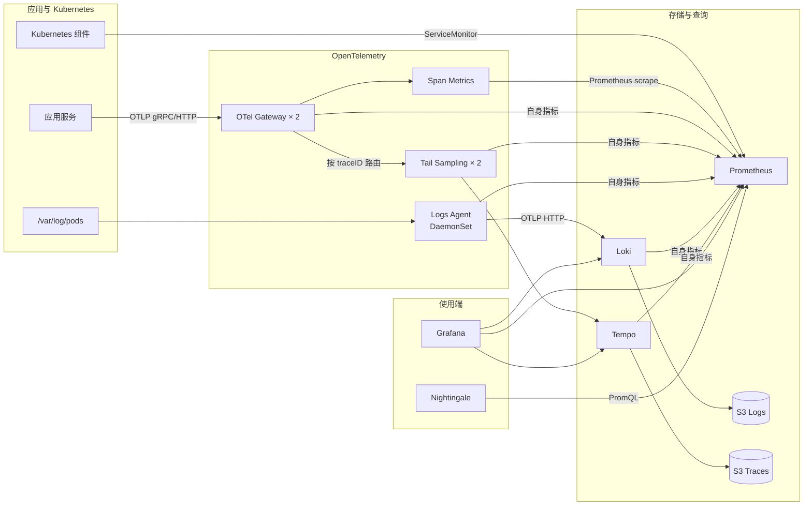

# 在 EKS 上搭建一套 Metrics、Logs、Traces 一体化可观测平台

> 一篇关于 Prometheus、OpenTelemetry、Loki、Tempo、Grafana 和 Nightingale 的生产实践笔记  
> 配置快照：2026-09  
> 本文已脱敏，账号、集群、域名、CIDR、ARN、bucket 和业务名称均使用占位符

## 写在前面

最早搭监控时，我们通常从 Prometheus 开始；遇到线上问题以后，又补一个 Loki；再往后为了分析跨服务调用，继续部署 Tempo 或 Jaeger。三个系统都有了，但数据还是割裂的：指标告诉我们“出问题了”，日志告诉我们“报了什么错”，Trace 才能解释“请求到底在哪一跳变慢”。

这次改造的目标不是简单把三个开源组件安装进 Kubernetes，而是把它们连接成一条完整的排障链路：

```text
告警发现异常
  -> 指标确定受影响服务和时间窗口
  -> Trace 找到慢调用或错误调用
  -> trace_id 跳转到对应日志
  -> 回到 Pod、节点和 Kubernetes 事件定位根因
```

最终采用的核心组件是：

- Prometheus：Kubernetes 与应用指标存储和 PromQL 查询；
- OpenTelemetry Operator/Collector：Trace、日志采集、尾部采样和 Span Metrics；
- Loki：容器日志存储和 LogQL 查询；
- Tempo：分布式 Trace 存储和查询；
- Grafana：Metrics、Logs、Traces 的统一查询与关联；
- Nightingale：告警规则评估、事件管理和通知。

这篇笔记重点记录四件事：部署过程、架构设计、关键参数，以及系统上线以后仍需要继续优化的部分。

## 一、先看最终架构



这里有三个比较重要的设计点。

第一，应用只需要认一个 OTel Gateway，不直接感知 Tempo、采样器或指标后端。以后更换存储，应用不需要跟着改。

第二，Span Metrics 必须在尾部采样之前生成。正常 Trace 最终只保留 5%，但请求量、错误率和延迟指标不能也只剩 5%，否则告警会严重失真。

第三，日志 Agent 必须是 DaemonSet。容器日志文件在节点本地，中心化 Deployment 看不到所有节点的 `/var/log/pods`。

## 二、当前生产组件和规模

为了让后面的参数有上下文，先列一下脱敏后的生产快照。

| 组件 | 版本 | 部署形态 |
|---|---|---|
| kube-prometheus-stack | 86.2.3 | Helm |
| Prometheus | 3.12.0 | StatefulSet，当前 1 副本 |
| Prometheus Operator | 0.91.0 | Deployment，1 副本 |
| OpenTelemetry Operator | 0.156.0 | Deployment，1 副本 |
| OTel Gateway | Collector Contrib 0.156.0 | Deployment，2 副本 |
| OTel Tail Sampling | Collector K8s 0.156.0 | StatefulSet，2 副本 |
| OTel Logs Agent | Collector Contrib 0.156.0 | DaemonSet，每节点 1 个 |
| Loki | 3.7.3 | Monolithic，2 副本 |
| Tempo | 2.10.7 | Distributed |
| Nightingale | 8.5.1 | 独立告警平台 |

当前 Prometheus 大约维护 59.8 万条活跃序列，写入速率约 3.91 万 samples/s。容器日志 Agent 覆盖 17 个节点。这个量级还没有逼迫 Loki 和 Tempo 做极限横向扩展，但已经足以暴露单点、基数和故障域问题。

## 三、部署前准备

### 1. 统一 namespace 和节点池

所有可观测性组件放在独立 namespace：

```bash
kubectl --context <PROD_CONTEXT> create namespace <OBS_NAMESPACE>
```

核心控制面组件优先放到 `<SYSTEM_NODE_POOL>`，业务节点只运行 node-exporter 和日志 Agent 等 node-local workload。

这里有一个容易忽略的问题：节点选择器并不等于高可用。如果 system 节点池只有两台机器，即便每个组件都设置了两个副本，所有组件仍然集中在两个故障点上。因此部署前应同时确认：

- 节点数量；
- 可用区分布；
- requests 之后的剩余容量；
- anti-affinity 和 topology spread 是否真的渲染到 workload。

### 2. 准备 gp3 StorageClass

Prometheus、Loki 和 Tempo Ingester 都需要 RWO 持久卷。EBS 是可用区级资源，所以每个 StatefulSet 副本必须拥有自己的 PVC，而不是让多个副本共享同一个卷。

建议开启：

- `volumeBindingMode: WaitForFirstConsumer`；
- `allowVolumeExpansion: true`；
- gp3，并根据实际吞吐调整 IOPS/throughput。

PVC 只能扩容，不能缩容。仓库 values 与现场容量不一致会导致新副本拿到错误大小的盘，后面会再次提到这个问题。

### 3. 对象存储与 IRSA

Loki 和 Tempo 分别使用独立 S3 bucket：

```text
<LOG_BUCKET>
<TRACE_BUCKET>
```

基础要求：

- Block Public Access；
- 默认加密；
- versioning；
- 生命周期与组件 retention 不冲突；
- 使用 IRSA，不在 values 中保存 Access Key/Secret Key；
- 日志、Trace 和未来 Metrics bucket 分离，便于权限、成本和生命周期治理。

脱敏后的 ServiceAccount 形式如下：

```yaml
apiVersion: v1
kind: ServiceAccount
metadata:
  name: <COMPONENT_SERVICE_ACCOUNT>
  namespace: <OBS_NAMESPACE>
  annotations:
    eks.amazonaws.com/role-arn: <IRSA_ROLE_ARN>
```

## 四、第一步：部署 Prometheus

Prometheus 使用 kube-prometheus-stack，Grafana 和 Alertmanager 不在这个 release 中部署：

```yaml
grafana:
  enabled: false

alertmanager:
  enabled: false

prometheus:
  prometheusSpec:
    scrapeInterval: 15s
    retention: 30d
    enableRemoteWriteReceiver: true
    storageSpec:
      volumeClaimTemplate:
        spec:
          storageClassName: gp3
          accessModes: ["ReadWriteOnce"]
          resources:
            requests:
              storage: 300Gi
```

安装命令：

```bash
helm upgrade --install monitoring prometheus-community/kube-prometheus-stack \
  --kube-context <PROD_CONTEXT> \
  --namespace <OBS_NAMESPACE> \
  --version 86.2.3 \
  --values prom-stack/values.yaml \
  --wait \
  --timeout 15m
```

### 当前关键参数

| 参数 | 当前值 | 说明 |
|---|---:|---|
| scrape interval | 15s | Kubernetes 和应用监控的统一默认周期 |
| retention | 30d | 当前全部指标保存在本地 PVC |
| PVC | 现场 300Gi | 仓库/CR 曾仍声明 200Gi，属于配置漂移 |
| remote-write receiver | 开启 | 当前有真实写入流量，不能直接关闭 |
| replicas | 1 | 当前最大单点 |

### 这里踩过的坑：扩盘不等于改了 Git

现场 PVC 已经从 200Gi 扩到 300Gi，但 Prometheus CR 和仓库 values 仍然是 200Gi。现有卷不会自动缩回去，看起来“一切正常”；一旦增加第二个 Prometheus 副本，新 PVC 就会按 200Gi 创建。

所以扩容完成以后必须同步修改 Git 声明，并通过 Helm diff 或 GitOps 检查漂移。

### 另一个坑：remote-write 和双副本不是一回事

两个 Prometheus 独立抓取同一批 targets，可以实现 scrape HA。但把 remote-write Service 后端从一个 Pod 改成两个 Pod，只会让写请求被随机拆分，每个 Prometheus 收到一部分数据，并不会自动复制。

因此后续 Prometheus HA 改造必须拆成两部分：

1. 两个 Prometheus + Thanos Query，解决 scrape 和查询 HA；
2. Thanos Receive、Mimir 或托管 Prometheus，解决 remote-write 复制。

## 五、第二步：安装 OpenTelemetry Operator

Operator 负责根据 `OpenTelemetryCollector` 和 `Instrumentation` CR 创建 Collector、Service 和自动注入配置。

```bash
helm upgrade --install opentelemetry-operator \
  open-telemetry/opentelemetry-operator \
  --kube-context <PROD_CONTEXT> \
  --namespace <OBS_NAMESPACE> \
  --version 0.120.0 \
  --values opentelemetry-operator/values.yaml \
  --wait
```

安装后至少检查：

```bash
kubectl --context <PROD_CONTEXT> -n <OBS_NAMESPACE> \
  get deployment opentelemetry-operator

kubectl --context <PROD_CONTEXT> \
  get crd opentelemetrycollectors.opentelemetry.io
```

应用侧的 `Instrumentation` 把 OTLP endpoint 统一指向 Gateway：

```yaml
apiVersion: opentelemetry.io/v1alpha1
kind: Instrumentation
metadata:
  name: default
  namespace: <OBS_NAMESPACE>
spec:
  exporter:
    endpoint: http://<OTEL_GATEWAY_SERVICE>:4318
  propagators:
    - tracecontext
    - baggage
    - b3
  sampler:
    type: always_on
```

这里使用 `always_on` 并不意味着 Tempo 会保存全部 Trace。完整数据先到 Gateway 和 Tail Sampling，最终保留比例由尾部采样策略决定。

## 六、第三步：先部署 Tempo 后端

先部署存储，再启动 Trace Collector，可以避免 Collector 持续重试甚至丢数据。

当前 Tempo 采用 distributed chart：

```yaml
storage:
  trace:
    backend: s3
    s3:
      bucket: <TRACE_BUCKET>
      endpoint: s3.<CLOUD_REGION>.amazonaws.com
      region: <CLOUD_REGION>

ingester:
  replicas: 3
  persistence:
    enabled: true
    storageClass: gp3
    size: 20Gi
  config:
    replication_factor: 3
    flush_all_on_shutdown: true

distributor:
  replicas: 2

querier:
  replicas: 2

queryFrontend:
  replicas: 2

compactor:
  replicas: 1
  config:
    compaction:
      block_retention: 168h
```

部署：

```bash
helm upgrade --install tempo grafana-community/tempo-distributed \
  --kube-context <PROD_CONTEXT> \
  --namespace <OBS_NAMESPACE> \
  --version 2.25.2 \
  --values tempo/values.yaml \
  --wait \
  --timeout 15m
```

### 为什么是 3 个 Ingester

Ingester 的 replication factor 为 3，三个副本各自有 20Gi WAL PVC。Distributor 将 Trace 写入多个 Ingester，单个 Pod 重启时仍可继续写入，并在恢复后从 WAL 重放。

不过“3 个 Pod”不自动等于“3 个可用区”。实际检查发现，Ingester 只有软反亲和，而且 chart 顶层 `defaults.nodeSelector` 没有像预期那样出现在 Ingester StatefulSet 中。

这带来一个很实用的经验：不要只检查 values，要检查渲染后的 StatefulSet：

```bash
kubectl --context <PROD_CONTEXT> -n <OBS_NAMESPACE> \
  get statefulset <TEMPO_INGESTER_STATEFULSET> -o yaml
```

重点看 `nodeSelector`、`affinity`、`topologySpreadConstraints` 和 PVC 模板。

### 大 Trace 查询的 gRPC 限制

Query Frontend 和 Querier 默认消息上限可能不够。当前统一把 gRPC 收发上限提高到 16MiB，并同时配置两端：

```yaml
server:
  grpc_server_max_recv_msg_size: 16777216
  grpc_server_max_send_msg_size: 16777216
```

只改 Query Frontend 或只改 Querier 都不完整，请求仍可能在另一端被拒绝。

## 七、第四步：Gateway、Span Metrics 和尾部采样

### 1. Gateway 按 Trace ID 分流

Tail Sampling 要看到一条 Trace 的全部 Span 才能做出正确决定。如果普通 Service 随机把 Span 分给两个采样器，一条 Trace 会被拆开。

因此 Gateway 使用 load-balancing exporter，并以 `traceID` 为 routing key：

```yaml
exporters:
  load_balancing:
    routing_key: traceID
    protocol:
      otlp:
        timeout: 5s
        tls:
          insecure: true
    resolver:
      dns:
        hostname: <TAIL_SAMPLING_HEADLESS_SERVICE>
        port: "4317"
        interval: 5s
```

Gateway 部署两个副本，并设置 PDB `maxUnavailable: 1`。

### 2. Span Metrics 放在采样之前

Gateway 同时运行 Span Metrics Connector：

```yaml
connectors:
  span_metrics:
    namespace: traces.span.metrics
    exclude_dimensions:
      - span.name
    aggregation_cardinality_limit: 10000
    metrics_expiration: 10m
    series_expiration: 10m
    histogram:
      unit: ms
      explicit:
        buckets: [10ms, 50ms, 100ms, 250ms, 500ms, 1s, 2s, 5s, 10s]
    dimensions:
      - name: deployment.environment
      - name: http.request.method
      - name: http.response.status_code
```

我们特意移除了 `span.name`。实际业务中的 Span 名经常包含 URL ID、文件名或动态参数，把它变成 Prometheus label 会让时序数量持续膨胀。

Prometheus 通过 PodMonitor 抓取 Gateway 的 8889 端口：

```yaml
podMetricsEndpoints:
  - port: span-metrics
    interval: 15s
    scrapeTimeout: 10s
```

### 3. 尾部采样策略

当前策略不是简单的“随机保留 5%”，而是先保住有价值的 Trace：

```yaml
tail_sampling:
  decision_wait: 15s
  num_traces: 20000
  expected_new_traces_per_sec: 500
  decision_cache:
    sampled_cache_size: 100000
    non_sampled_cache_size: 100000
  policies:
    - name: keep-errors
      type: status_code
      status_code:
        status_codes: [ERROR]

    - name: keep-slow-traces
      type: latency
      latency:
        threshold_ms: 2000

    - name: sample-normal-traces
      type: probabilistic
      probabilistic:
        sampling_percentage: 5
```


这意味着：错误 Trace 全保留、超过 2 秒的 Trace 全保留，其余正常流量保留 5%。

`num_traces` 不能凭感觉配置。它至少要覆盖 `expected_new_traces_per_sec × decision_wait`，还要给突发流量留空间。必须持续监控 `dropped_too_early`，一旦出现就说明容量或等待时间配置不够。

## 八、第五步：部署 Loki

当前日志量不大，因此先采用 Loki Monolithic，而不是一上来就拆 Distributor、Ingester、Querier、Compactor。

```yaml
deploymentMode: Monolithic

loki:
  auth_enabled: false
  commonConfig:
    replication_factor: 2
  schemaConfig:
    configs:
      - from: <SCHEMA_START_DATE>
        store: tsdb
        object_store: s3
        schema: v13
        index:
          prefix: index_
          period: 24h
  storage:
    type: s3
    bucketNames:
      chunks: <LOG_BUCKET>
      ruler: <LOG_BUCKET>
  limits_config:
    retention_period: 720h
    max_query_lookback: 720h
    split_queries_by_interval: 1h
    max_query_parallelism: 16
    max_entries_limit_per_query: 5000

singleBinary:
  replicas: 2
  persistence:
    enabled: true
    storageClass: gp3
    size: 30Gi
  resources:
    requests:
      cpu: 500m
      memory: 1Gi
    limits:
      cpu: "2"
      memory: 3Gi
```

安装：

```bash
helm upgrade --install loki grafana-community/loki \
  --kube-context <PROD_CONTEXT> \
  --namespace <OBS_NAMESPACE> \
  --version 18.5.1 \
  --values loki/values.yaml \
  --wait \
  --timeout 15m
```

### 查询保护参数

日志平台最容易因为一个超大时间范围查询把 CPU、内存和 S3 请求一起拉满，所以当前做了几层限制：

- 查询按 1 小时切分；
- 最大查询并行度 16；
- Querier 单副本最大并发 4；
- 单次最多返回 5,000 条日志；
- 最大回看范围与 retention 均为 30 天；
- 慢请求超过 10 秒记录日志；
- S3 hedging 延迟到 1 秒，每秒最多 5 次，最多并发 2 个副本请求；
- Compactor retention delete worker 限制为 20。

chunks cache 和 results cache 当前关闭。默认缓存配置会额外吃掉大量内存，而当前查询量还没有证明缓存是瓶颈。缓存应该由查询 p95/p99 和 S3 请求成本驱动，而不是“生产环境必须有”。

### 两副本 Loki 的真实边界

两个 Loki 副本、复制因子 2，在两个副本都正常时会写两份数据；但写 quorum 需要两个副本，任意一个 Pod 或系统节点故障都可能中断新日志写入。

已写入 S3 的历史数据不会因此丢失，但这不是完整的写入 HA。理想目标是三个跨故障域副本、复制因子 3，这样失去一个副本时仍能满足 2/3 quorum。

在只有两个 system 节点的环境中直接扩成三个 Loki 意义不大，所以正确顺序应该是先扩节点池和故障域，再改 Loki 副本数。

## 九、第六步：用 OTel DaemonSet 采集容器日志

日志 Agent 读取每个节点的容器日志：

```yaml
spec:
  mode: daemonset
  tolerations:
    - operator: Exists
  volumeMounts:
    - name: varlogpods
      mountPath: /var/log/pods
      readOnly: true
    - name: offsets
      mountPath: /var/lib/otelcol
  volumes:
    - name: varlogpods
      hostPath:
        path: /var/log/pods
        type: Directory
    - name: offsets
      hostPath:
        path: /var/lib/otelcol/logs
        type: DirectoryOrCreate
```

filelog receiver 使用持久化 offset：

```yaml
extensions:
  file_storage:
    directory: /var/lib/otelcol

receivers:
  file_log:
    include:
      - /var/log/pods/*/*/*.log
    start_at: end
    include_file_path: true
    storage: file_storage
    operators:
      - type: container
```

Exporter 写入 Loki 的 OTLP HTTP 入口，并开启持久队列：

```yaml
exporters:
  otlp_http/loki:
    endpoint: http://<LOKI_GATEWAY_SERVICE>/otlp
    compression: gzip
    timeout: 10s
    retry_on_failure:
      enabled: true
      initial_interval: 1s
      max_interval: 30s
      max_elapsed_time: 5m
    sending_queue:
      enabled: true
      storage: file_storage
      queue_size: 2000
```

注意 endpoint 只写到 `/otlp`，Collector 会自动追加 `/v1/logs`。

### 为什么不做全局多行正则

多行异常堆栈需要合并，但对所有容器套同一个正则会带来误合并、CPU 增加和大日志内存压力。

当前只对确认有多行输出的少量容器启用 `recombine`，并设置：

- 1 秒强制 flush；
- 最大 100 条合并；
- 最大单条日志 256KiB；
- 其他应用不执行多行合并。

长期方案仍然是应用输出单行 JSON，并把 `level`、`message`、`trace_id`、`span_id` 和 `service.name` 结构化写入。

### 高日志量工作负载

有一类动态工作负载会产生大量低价值日志。当前在文件路径层直接排除，并在 resource attribute filter 再过滤一次，降低 CPU、文件句柄和网络成本。

静态排除不是最终治理方式。更好的做法是建立 namespace/service 级日志预算，区分：

- 必须保留的审计和错误日志；
- 可采样的 info 日志；
- 应在源头关闭的 debug 日志；
- 需要独立低成本存储的批量日志。

## 十、第七步：补齐自监控和告警

可观测平台最尴尬的故障是“业务遥测已经丢了，但监控系统自己没有发现”。因此 OTel Collector 的 8888 端口需要按 Pod 抓取，不能只抓 ClusterIP。

```yaml
apiVersion: monitoring.coreos.com/v1
kind: ServiceMonitor
metadata:
  name: otel-collector-self-monitoring
  namespace: <OBS_NAMESPACE>
  labels:
    release: monitoring
spec:
  selector:
    matchExpressions:
      - key: operator.opentelemetry.io/collector-service-type
        operator: In
        values: [monitoring]
  endpoints:
    - port: monitoring
      interval: 30s
      scrapeTimeout: 10s
```

按 Pod 抓取以后，至少需要以下告警：

- Collector target down；
- exporter send failed；
- sending queue 超过 80%；
- receiver failed/refused；
- memory limiter 拒绝数据；
- tail sampling trace dropped too early；
- tail sampling policy evaluation error。

应用侧 Span Metrics 当前有三条基础告警：

| 告警 | 当前阈值 |
|---|---|
| Trace 错误率高 | 5 分钟错误率 >5%，且请求率 >1/s |
| P95 延迟高 | 服务端 Span P95 >2 秒，持续 10 分钟 |
| 错误 Trace 突增 | 5 分钟超过 20 个错误 Span |

告警由 Nightingale 查询 Prometheus 并发送通知，Prometheus Alertmanager 保持关闭，避免两套通知链路重复告警。

## 十一、Grafana 中如何把三种信号连起来

Grafana 配置三个数据源：Prometheus、Loki、Tempo。

关联能力依赖一套统一字段：

```text
service.name
deployment.environment
k8s.cluster.name
trace_id
span_id
```

应用日志必须把当前 Trace 上下文写入日志。这样可以实现：

- Loki derived field：点击日志里的 `trace_id` 打开 Tempo；
- Tempo Trace to Logs：从 Span 的 service、namespace 和时间范围跳转到 Loki；
- Span Metrics：从服务错误率或延迟面板缩小 Trace 查询范围。

一条常用排障路径是：

1. Nightingale 报告某服务错误率超过 5%；
2. 在 Grafana 查看该服务 Span Metrics；
3. 打开同一时间窗口的错误 Trace；
4. 从 Trace 跳到同一 `trace_id` 的日志；
5. 对照 Prometheus 中 Pod CPU、内存、重启和节点事件。

## 十二、上线验证

### 1. Kubernetes 状态

```bash
kubectl --context <PROD_CONTEXT> -n <OBS_NAMESPACE> \
  get deployment,statefulset,daemonset,pod,pvc,pdb -o wide
```

检查重点：

- 所有副本 Ready；
- 有状态 Pod 各自绑定独立 PVC；
- 双副本没有落在同一节点；
- 关键组件有 PDB；
- 没有 Pending、OOMKilled 或持续重启。

### 2. Metrics

```promql
prometheus_tsdb_head_series
rate(prometheus_tsdb_head_samples_appended_total[5m])
up{namespace="<OBS_NAMESPACE>"}
traces_span_metrics_calls_total
```

### 3. Logs

```logql
{k8s_namespace_name="<APPLICATION_NAMESPACE>"}
```

验证新日志可在合理延迟内查询，Kubernetes labels 存在，多行异常没有被错误拆分或无限合并。

### 4. Traces

- 发送一条正常请求、一条错误请求和一条超过 2 秒的慢请求；
- 错误与慢请求必须被保留；
- 正常 Trace 按概率出现；
- Span Metrics 的 calls、error 和 duration bucket 都增长；
- 日志中的 trace ID 可以打开对应 Trace。

### 5. 自监控

```promql
up{service=~"otel-.*-collector-monitoring"}
otelcol_exporter_queue_size
otelcol_exporter_send_failed_spans
otelcol_exporter_send_failed_log_records
```

指标名称会随 OTel 版本变化。升级 Collector 时，必须把告警规则兼容性检查设为发布门禁。

## 十三、当前架构的已知边界

### 1. Prometheus 是单点

Prometheus 当前只有一个副本，又是 Nightingale 的数据源。一旦 Prometheus 不可用，指标查询和告警评估会一起受影响。

### 2. Loki 两副本无法容忍一个写入副本故障

RF2 需要两个副本共同完成写入。历史数据仍在 S3，但新日志写入可能中断。

### 3. system 节点池只有两个节点

多个双副本组件看起来都有 HA，实际上共同依赖同两台机器。节点维护、资源压力或单 AZ 故障会同时影响多条链路。

### 4. 外部入口缺少统一身份认证

外部查询入口有 TLS 和 CIDR allowlist，但 Loki 本身 `auth_enabled: false`。网络白名单不是用户身份认证，也缺少细粒度审计。

### 5. 告警覆盖不完整

Trace 和 OTel 自监控已有规则文件，但 Loki、Tempo、Prometheus 自身、S3、PVC、Canary 和通知 heartbeat 还需要补成完整规则包。

### 6. 日志队列和尾采样状态不是跨节点持久化

日志 Agent 的 queue 保存在节点 hostPath；节点永久丢失时，未发送数据也会丢失。Tail Sampling 的未决策 Trace 在内存中，Pod 重启时无法恢复。

这些不是配置错误，但需要被明确写进 RPO 和故障演练范围。

## 十四、下一步优化路线

### 优先级 0：先消除真正的单点

#### Prometheus 双副本 + Thanos

目标形态：

```text
Prometheus x2，每个独立 PVC、独立 scrape
  -> Thanos Sidecar
  -> S3 <METRICS_BUCKET>

Grafana/Nightingale
  -> Query Frontend x2
  -> Thanos Query x2
  -> Sidecar + Store Gateway x2

Compactor x1
```

Query 使用 `prometheus_replica` 去重。Grafana 和 Nightingale 只访问统一 Query 入口，不再绑定某个 Prometheus。

remote-write 单独迁移到 Thanos Receive 或其他复制接收层。确认所有发送端稳定迁移以后，才关闭 Prometheus 的 receiver。

#### 补全告警即代码

把以下规则全部做成可导入 Nightingale 的 YAML：

- Prometheus replica、target、TSDB、WAL、PVC、规则评估；
- Loki ring、write/query error、compactor、S3、PVC、Canary；
- Tempo Distributor、Ingester ring/WAL、Querier、Compactor、S3；
- OTel receiver/exporter/queue/memory/tail sampling；
- Nightingale rule query、通知失败和 synthetic heartbeat。

### 优先级 1：扩展故障域

- system 节点池扩到至少三个节点，优先覆盖三个 AZ；
- Loki 改为 3 副本 + RF3；
- Gateway、Tail Sampling、Query 组件增加 hard hostname anti-affinity 和 zone spread；
- Tempo Ingester 明确节点池，并验证三个副本的跨区分布；
- 每季度执行节点 drain 和单副本故障演练。

### 优先级 2：安全收口

- 外部查询入口改为私网优先，或统一接入 OIDC/OAuth2 Proxy/WAF；
- 为可观测性数据面增加 NetworkPolicy；
- OTel Logs Agent 增加 seccomp、drop capabilities 和只读 root filesystem；
- 收敛日志 Agent ClusterRole；
- 镜像同时固定 tag 和 digest；
- 账号、ARN、域名、CIDR、bucket 等环境参数从共享文档和通用 values 中抽离；
- 开启仓库 secret scanning 和提交前扫描。

### 优先级 3：容量和成本治理

- 建立 Prometheus cardinality Top-N 周报；
- 建立 Loki namespace/service ingest bytes 和 entries/s 预算；
- 根据 14–30 天 p95/p99 调整 OTel requests，而不是按一次 `kubectl top` 缩容；
- 根据真实查询延迟再决定是否启用 Loki cache；
- 按服务区分 Trace 采样率和慢请求阈值；
- 监控 S3 GET/LIST/PUT、4xx/5xx、SlowDown 和月度增长；
- 定义查询可用性、摄取延迟、Trace 接收率和告警送达延迟 SLO。

## 十五、一些最终经验

### 1. 副本数不是高可用的全部

两个副本如果都落在同一节点，或者都依赖同一个 Prometheus、同一个网络入口，高可用只是表面现象。必须从 Pod、节点、可用区、存储、查询入口和告警链路一起看。

### 2. 先控制基数，再谈扩容

Prometheus 和 Loki 的成本往往不是因为请求量本身，而是 labels 失控。动态 URL、用户 ID、Trace ID、文件路径都不应该直接成为指标或日志标签。

### 3. 采集端也必须被监控

Collector Pod Ready 不代表数据一定成功送达。receiver refused、memory limiter、exporter queue 和 send failed 才是真正的数据完整性信号。

### 4. values.yaml 不是最终事实

Chart 默认值、模板逻辑、历史 Helm values 和现场手工扩容都可能造成漂移。上线前检查渲染结果，上线后检查实际 StatefulSet/Deployment/PVC，二者缺一不可。

### 5. 对象存储解决持久化，不自动解决实时可用性

Loki 和 Tempo 的历史 block 在 S3，并不意味着 Ingester 或写 quorum 故障时还能持续接收实时数据。写路径、读路径和长期存储需要分别设计。

## 结语

这套平台目前已经完成了 Metrics、Logs、Traces 的基本闭环，也具备尾部采样、Span Metrics、结构化元数据、S3 长期存储和 Collector 自监控等生产能力。

接下来最重要的工作不是继续增加组件，而是把现有链路变得更可靠：消除 Prometheus 单点、正确迁移 remote-write、扩展系统节点故障域、把 Loki 提升到可容忍单副本故障，并补齐统一认证和告警即代码。

可观测性的终点不是“部署了多少组件”，而是在故障发生时，团队能否快速回答三个问题：哪里出了问题、为什么出问题、修复以后如何证明它不会再次发生。
