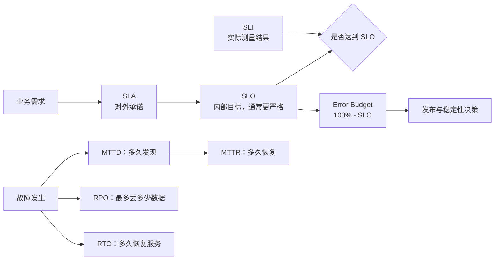

# SRE 核心指标：SLI、SLO、SLA、错误预算与灾备目标

SRE 中常见的可靠性概念可以分成两组：

- **日常服务质量**：SLI、SLO、SLA、Error Budget；
- **故障与灾难恢复**：RTO、RPO，以及 MTTD、MTTR、MTBF。

一句话记忆：

> **SLI 是实际成绩，SLO 是内部目标，SLA 是对外承诺，Error Budget 是允许犯错的额度；RTO 是多久恢复，RPO 是最多丢多少数据。**

## 概念关系



## 核心概念速查

| 名词 | 中文 | 核心问题 | 典型表达 |
|---|---|---|---|
| SLI | 服务水平指标 | 实际表现怎么样？ | 过去 30 天成功率为 99.95% |
| SLO | 服务水平目标 | 内部要求达到多少？ | 30 天成功率不低于 99.9% |
| SLA | 服务水平协议 | 对客户承诺多少？ | 未达到 99.9% 时提供服务补偿 |
| Error Budget | 错误预算 | 在目标范围内允许失败多少？ | `100% - SLO` |
| RTO | 恢复时间目标 | 故障后多久必须恢复？ | 1 小时内恢复业务 |
| RPO | 恢复点目标 | 最多允许丢多少数据？ | 最多丢失 30 分钟数据 |
| MTTD | 平均故障发现时间 | 故障发生后多久被发现？ | 越低越好 |
| MTTR | 平均恢复时间 | 发现故障后多久恢复？ | 越低越好 |
| MTBF | 平均故障间隔 | 两次故障之间稳定运行多久？ | 越高越好 |

## SLI：用用户体验衡量实际表现

**SLI（Service Level Indicator）**是服务的实际测量值。常见 SLI 包括：

- 请求成功率或可用性；
- P95、P99 延迟达标率；
- 下单、支付、登录等关键业务成功率；
- 数据正确率、完整性和新鲜度；
- 数据持久性。

例如：

```text
过去 30 天：
成功请求数 / 总请求数 = 99.95%

SLI = 99.95%
```

`CPU < 80%`、`Pod Running`、`磁盘使用率 < 80%` 很重要，但它们通常不是好的业务 SLI，因为它们不能直接回答：

> 用户现在能否正常使用服务？

设计 SLI 时，应优先选择最接近用户体验和业务结果的指标。

## SLO：给 SLI 设定内部目标

**SLO（Service Level Objective）**是团队希望 SLI 达到的目标。

```text
SLI：过去 30 天实际请求成功率为 99.96%
SLO：过去 30 天请求成功率不低于 99.9%
```

在这个例子中，实际结果高于目标，因此 SLO 达标。

一个可执行的 SLO 至少应明确：

1. 测量对象，例如 HTTP 请求或关键交易；
2. 统计口径，例如成功请求比例；
3. 时间窗口，例如滚动 30 天；
4. 目标值，例如 99.9%；
5. 排除条件，例如计划维护或明确不计入的流量。

## SLA：面向客户的正式承诺

**SLA（Service Level Agreement）**是企业向客户作出的正式服务承诺。未达到 SLA 时，可能涉及 Service Credit、服务费补偿或合同责任。

通常应该保留安全余量：

```text
SLA = 99.9%
SLO = 99.95%
```

即内部目标应比外部承诺更严格。若 `SLO = SLA`，服务只要轻微波动，就可能直接触发违约。

## 可用性中的“几个 9”

按 30 天计算：

| 可用性 | 每月最多不可用时间 |
|---|---:|
| 99% | 7 小时 12 分钟 |
| 99.9% | 43 分 12 秒 |
| 99.95% | 21 分 36 秒 |
| 99.99% | 约 4 分 19 秒 |
| 99.999% | 约 26 秒 |

“四个 9”意味着一个月只能中断约 4 分钟。发布事故、应用缺陷、数据库、网络、DNS 和云平台故障都可能共同消耗这段时间，因此不能只靠增加副本数实现。

## Error Budget：用错误预算平衡稳定性与迭代速度

错误预算的基本公式是：

```text
Error Budget = 100% - SLO
```

如果 30 天 SLO 为 99.9%：

```text
允许失败比例 = 0.1%
30 天总时长 = 43,200 分钟
错误预算 = 43,200 × 0.1% = 43.2 分钟
```

错误预算不是“可以故意宕机的时间”，而是一段可承受的风险额度：

- **预算接近耗尽**：减少高风险发布，优先修复稳定性问题；
- **预算仍然充足**：可以更积极地发布、灰度和推进架构改造；
- **预算持续透支**：说明当前可靠性能力与业务目标不匹配，需要调整工程投入或重新审视 SLO。

SRE 追求的不是不计成本的 100% 稳定，而是在满足业务目标的前提下平衡可靠性与变化速度。

## RTO 与 RPO：灾难发生后的两个目标

### RTO：多久恢复服务

**RTO（Recovery Time Objective）**表示发生故障后，业务最多允许中断多久。

```text
14:00 发生故障
RTO = 1 小时
最晚应在 15:00 恢复业务
```

RTO 越小，越需要多可用区、热备、自动健康检查、自动故障转移和自动切流。

### RPO：最多丢多少数据

**RPO（Recovery Point Objective）**表示发生灾难后，最多允许回退到多早的数据状态。

```text
14:00 数据库损坏
RPO = 30 分钟
最差允许恢复到 13:30
```

备份与复制策略决定了能够实现的 RPO：

| 数据保护方式 | 典型 RPO |
|---|---:|
| 每天一次全量备份 | 约 24 小时 |
| 每小时备份 | 约 1 小时 |
| WAL/日志持续归档与 PITR | 分钟级或更低 |
| 同步复制 | 理论上接近 0 |

RPO 越低，通常意味着更高的成本、复杂度和性能代价。

### 两者不要混淆

```text
13:30             14:00                 15:00
  │                 │                     │
允许恢复点          故障发生              最晚恢复
  │<--- RPO 30m --->│<----- RTO 1h ----->│
```

- RPO 关注**数据最多丢多少**；
- RTO 关注**服务多久恢复**。

SLO/SLA 描述平时服务质量，RTO/RPO 描述重大故障或灾难发生后的恢复目标，它们不能互相替代。

## MTTD、MTTR 与 MTBF

- **MTTD（Mean Time To Detect）**：平均故障发现时间，越低越好；
- **MTTR（Mean Time To Recovery）**：平均恢复时间，越低越好；
- **MTBF（Mean Time Between Failures）**：平均故障间隔，越高越好。

监控和告警主要降低 MTTD；标准化排障、自动回滚、故障切换和演练主要降低 MTTR；架构治理、测试和变更控制有助于提高 MTBF。

## 从目标反推架构，而不是为了高可用而高可用

| 工程手段 | 主要影响 |
|---|---|
| 多可用区、热备、自动 Failover | 降低 RTO |
| 健康检查、自动切流、自动回滚 | 降低 MTTR 和 RTO |
| WAL、PITR、持续备份 | 降低 RPO |
| 同步复制 | 将 RPO 降至接近 0 |
| 面向用户体验的监控 | 准确衡量 SLI |
| 告警与事件响应 | 降低 MTTD 和 MTTR |
| 灰度发布、限流、熔断 | 减少错误预算消耗 |

架构设计前应先回答：

1. 业务需要什么 SLA 和 SLO？
2. 哪些用户旅程应该成为 SLI？
3. 可接受的 RTO 和 RPO 是多少？
4. 为达到这些目标，需要多可用区、主从、自动切换、PITR 或异地灾备中的哪些能力？
5. 这些可靠性收益是否值得相应的成本和复杂度？

## 最终速记

```text
SLI：实际值
SLO：内部目标
SLA：外部承诺
Error Budget：100% - SLO

RTO：服务多久恢复
RPO：最多丢多少数据

MTTD：多久发现故障
MTTR：多久恢复故障
MTBF：两次故障间隔多久
```

> **SRE 的核心不是单纯追求 100% 稳定，而是用 SLI、SLO 和错误预算量化可靠性，再用 RTO、RPO 和事件指标指导架构与运营决策。**

## 整理来源

- [ChatGPT 分享：科普 SRE 核心指标](https://chatgpt.com/share/6ab0cbce-e2a8-83ec-89c8-bed02db35198)
